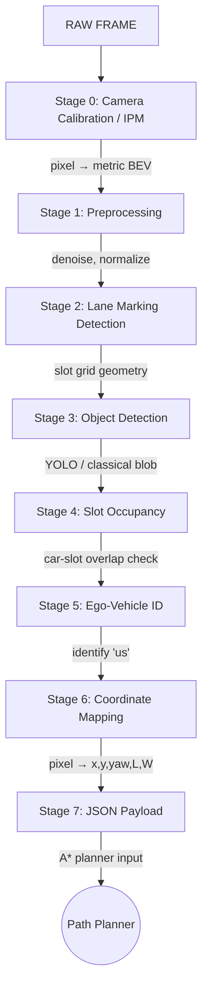

# AV Parking Assistant

A real-time parking assistance system using computer vision and AI to guide a vehicle into a parking spot. The system processes a live camera feed — either a physical webcam or a simulated camera in CARLA — and predicts driving directions to assist with precise parking maneuvers.

## Features

- Live video input via webcam or CARLA simulator
- Parking spot boundary detection
- Vehicle position & trajectory estimation
- Real-time overlay with distance indicators and alignment cues
- Obstacle detection and proximity warnings
- Support for both camera and CARLA sources via single config file

## Tech Stack

| Component          | Technology        |
|--------------------|-------------------|
| Computer Vision    | OpenCV            |
| AI / Detection     | YOLOv8 (planned)  |
| Simulation         | CARLA             |
| Rendering / UI     | OGRE3D + ImGui (planned) |
| Input Handling     | Pygame (manual mode) |
| Language           | Python >= 3.12    |

## Quick Start

### 1. Prerequisites

- Python >= 3.12
- pip

### 2. Setup Virtual Environment

```bash
python -m venv .venv
.venv\Scripts\activate      # Windows
# source .venv/bin/activate  # Linux / macOS
```

### 3. Install Dependencies

```bash
pip install -r requirements.txt
```

### 4. Run

**Webcam:**
```bash
python src/main.py --source camera --config config/config.json
```

**CARLA (manual driving):**
```json
# config/config.json → set "source_type": "carla", "manual": true
```
```bash
python src/main.py --config config/config.json
```

## CARLA Setup

### 1. Download CARLA

Download the latest CARLA release from:
https://carla.readthedocs.io/en/latest/start_quickstart/#download-and-extract-a-carla-package

Choose the Windows build (e.g. `CARLA_0.9.x.zip`).

### 2. Extract & Run

```bash
# Extract the zip
# Navigate to CARLA root and run the simulator:
CarlaUE4.exe -windowed -ResX=800 -ResY=600
```

The `-windowed` flag runs CARLA in a window. The server listens on `localhost:2000` by default.

### 3. Install the CARLA Python Wheel

In a separate terminal (with your virtual environment activated):

```bash
# Navigate to the CARLA Python API directory
cd <CARLA_ROOT>/PythonAPI/carla/dist/

# Install the wheel for your Python version
pip install carla-<version>-cp312-cp312-win_amd64.whl
```

The exact filename depends on your CARLA version and Python version.

### 4. Verify

```bash
python -c "import carla; print(carla.__version__)"
```

If no errors, CARLA is ready.

## Configuration

A single JSON config file (`config/config.json`) holds both camera and CARLA settings:

```json
{
  "source_type": "camera",

  "Camera": {
    "device_id": 0,
    "width": 1280,
    "height": 720,
    "fps": 30,
    "calibration": {
      "fx": 600.0,
      "fy": 600.0,
      "cx": 640.0,
      "cy": 360.0
    }
  },

  "Carla": {
    "host": "localhost",
    "port": 2000,
    "timeout": 10.0,
    "manual": false,
    "synchronous": true,
    "autopilot": false,
    "scenario": {
      "map": "Town01",
      "weather": "ClearNoon",
      "ego_vehicle": {
        "model": "vehicle.lincoln.mkz_2017",
        "spawn_point_index": 0
      }
    },
    "camera": {
      "position": { "x": -5.0, "y": 0.0, "z": 2.5 },
      "rotation": { "pitch": -15.0, "yaw": 0.0, "roll": 0.0 },
      "width": 1280,
      "height": 720,
      "fov": 90
    }
  }
}
```

### Fields Reference

#### Top-Level

| Field          | Type                | Default    | Description                           |
|----------------|---------------------|------------|---------------------------------------|
| `source_type`  | `"camera"` / `"carla"` | `"camera"` | Active input source                    |

#### Camera Section

| Field         | Type  | Default | Description               |
|---------------|-------|---------|---------------------------|
| `device_id`   | int   | `0`     | Camera device index       |
| `width`       | int   | `1280`  | Frame width               |
| `height`      | int   | `720`   | Frame height              |
| `fps`         | int   | `30`    | Target FPS                |
| `calibration` | obj   | `null`  | Camera intrinsics (fx,fy,cx,cy) |

#### Carla Section

| Field         | Type    | Default       | Description                           |
|---------------|---------|---------------|---------------------------------------|
| `host`        | string  | `"localhost"` | CARLA server IP                       |
| `port`        | int     | `2000`        | CARLA server port                     |
| `timeout`     | float   | `10.0`        | Connection timeout (seconds)          |
| `manual`      | bool    | `false`       | Enable keyboard driving via pygame    |
| `synchronous` | bool    | `true`        | Synchronous mode (fixed delta step)   |
| `autopilot`   | bool    | `false`       | CARLA autopilot                       |
| `scenario`    | obj     | —             | Map, weather, vehicle config          |
| `camera`      | obj     | —             | RGB camera position, rotation, FOV    |

## Manual Driving Controls

When `"manual": true` in the Carla config, use these keys:

| Key          | Action           |
|--------------|------------------|
| W / Up       | Throttle         |
| S / Down     | Brake            |
| A / Left     | Steer left       |
| D / Right    | Steer right      |
| Space        | Handbrake        |
| Q            | Toggle reverse   |
| P            | Toggle autopilot |
| ESC          | Quit             |

## CLI Arguments

```
usage: main.py [-h] [--source {camera,carla}] [--config CONFIG]

AV Parking Assistant

options:
  -h, --help            show this help message and exit
  --source {camera,carla}
                        Input source type (default: camera)
  --config CONFIG       Path to JSON config file
                        (default: ./config/config.json)
```

## Project Structure

```
av-parking-assistant/
├── config/
│   └── config.json                # Unified configuration
├── src/
│   ├── main.py                    # Entry point + CLI
│   ├── example.py                 # Interface usage example
│   ├── input/
│   │   ├── __init__.py            # Package exports
│   │   ├── config.py              # Dataclasses + JSON loader
│   │   ├── source_iface.py        # InputSource protocol
│   │   ├── camera_source.py       # OpenCV camera capture
│   │   └── carla_source.py        # CARLA simulator client
│   └── ifaces/
│       ├── data_iface.py          # Pose, YawAngle, Box
│       ├── perception_iface.py    # Detection protocols
│       ├── algorithms_iface.py    # Path planning protocols
│       └── util_iface.py          # Preprocessing/Display protocols
├── data/                          # Datasets (gitignored)
├── tests/                         # Tests (planned)
├── requirements.txt
└── README.md
```

## Architecture

The input layer follows a **protocol-based** design. Every source implements `InputSource`:

```
InputSource (Protocol)
├── CameraSource      → OpenCV VideoCapture
└── CarlaSource       → CARLA simulator client
```

```python
class InputSource(Protocol):
    def open(self) -> None: ...
    def read(self) -> Frame | None: ...
    def release(self) -> None: ...
```

The system interface contracts are defined in `src/ifaces/` for perception, path planning, and utilities — allowing any compliant implementation to be plugged in.

## Interface Contracts

| Protocol              | File                    | Purpose                                |
|-----------------------|-------------------------|----------------------------------------|
| `GetParkingSpace`     | `perception_iface.py`   | Detect parking space from image        |
| `GetObstacles`        | `perception_iface.py`   | Detect obstacles from image            |
| `GetCurrentPose`      | `perception_iface.py`   | Estimate vehicle pose from image       |
| `CalculateFinalPose`  | `algorithms_iface.py`   | Compute target pose inside parking spot|
| `PathPlanning`        | `algorithms_iface.py`   | Plan path around obstacles             |
| `PathToRoute`         | `algorithms_iface.py`   | Smooth path into drivable route        |
| `Preprocessing`       | `util_iface.py`         | Prepare image for model inference      |
| `Display`             | `util_iface.py`         | Render guidance overlay                |

## Frame Processing Pipeline



### Pipeline Stages

| Stage | Name | Description |
|-------|------|-------------|
| **0** | Camera Calibration / IPM | Convert pixel coordinates → bird's-eye metric coordinates |
| **1** | Preprocessing | Denoise, normalize illumination (CLAHE, bilateral filter) |
| **2** | Lane Marking Detection | Detect white slot lines → reconstruct slot grid geometry |
| **3** | Object Detection | Detect all vehicles (YOLOv8 or classical blob detection) |
| **4** | Slot Occupancy | For each slot: check if a detected vehicle overlaps it |
| **5** | Ego-Vehicle Identification | Determine which detected vehicle is "us" |
| **6** | Coordinate Mapping | Convert pixel bboxes → metric poses `(x, y, yaw, length, width)` |
| **7** | JSON Payload Assembly | Assemble structured data for the A* path planner |